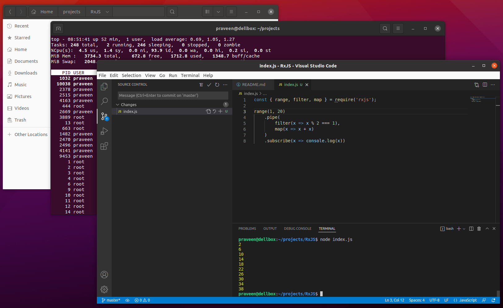

# RxJS

## Reactive Extentions Library for JavaScript

https://rxjs.dev/

https://github.com/ReactiveX/RxJS


# Experience



# Observable

**An observable represents a stream, or source of data that can arrive over time.** You can create an observable from nearly anything, but the most common use case in RxJS is from events. This can be anything from mouse moves, button clicks, input into a text field, or even route changes. The easiest way to create an observable is through the built in creation functions. For example, we can use the fromEvent helper function to create an observable of mouse click events:

```
// import the fromEvent operator
import { fromEvent } from 'rxjs';

// grab button reference
const button = document.getElementById('myButton');

// create an observable of button clicks
const myObservable = fromEvent(button, 'click');
```

https://www.learnrxjs.io/learn-rxjs/concepts/rxjs-primer


# Subscription

Subscriptions are what set everything in motion. You can think of this like a faucet, you have a stream of water ready to be tapped (observable), someone just needs to turn the handle. In the case of observables, that role belongs to the subscriber.

## Unicasting

By default, a subscription creates a one on one, one-sided conversation between the observable and observer. This is like your boss (the observable) yelling (emitting) at you (the observer) for merging a bad PR.

# Pipe

The pipe function is the assembly line from your observable data source through your operators. Just like raw material in a factory goes through a series of stops before it becomes a finished product, source data can pass through a pipe-line of operators where you can manipulate, filter, and transform the data to fit your use case. It's not uncommon to use 5 (or more) operators within an observable chain, contained within the pipe function.